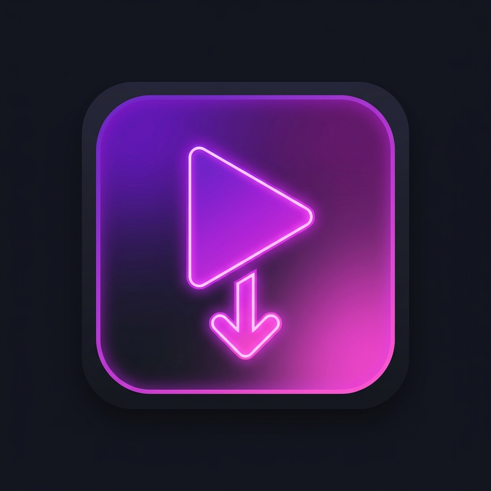

<div align="center">



# Reel Glide

### Auto-scroll Instagram Reels — hands free.

[](https://developer.chrome.com/docs/extensions/mv3/intro/)
[](https://www.google.com/chrome/)
[](https://www.microsoft.com/edge)
[](LICENSE)

</div>

---

## What is Reel Glide?

**Reel Glide** is a lightweight Manifest V3 browser extension for Chrome and Edge that automatically scrolls to the next Instagram Reel the moment the current one finishes — no tapping, no clicking, just pure endless flow.

---

## ✨ Features

| Feature | Description |
|---------|-------------|
| 🔄 **Auto Scroll** | Advances to the next Reel the instant the current one ends |
| ⏱️ **Configurable Delay** | Set a 0 ms – 3 s pause before scrolling via the popup slider |
| 🔁 **Loop Toggle** | Restart from the top of the feed when it ends |
| 🎨 **Premium Popup UI** | Dark-themed popup with gradient accents and live status badge |
| ⚡ **Lightweight** | Zero external dependencies — pure vanilla JS, ~5 KB total |
| 🔗 **SPA-Aware** | Intercepts `history.pushState` so it works across all Instagram navigation |

---

## 🚀 Installation

### Developer Mode (available right now)

1. **Clone** this repo or download the ZIP
   ```bash
   git clone https://github.com/notavishek/reel-glide.git
   ```
2. Open **`chrome://extensions`** in Chrome (or **`edge://extensions`** in Edge)
3. Enable **Developer mode** via the toggle in the top-right corner
4. Click **"Load unpacked"**
5. Select the **`Instagram Auto Scroll`** folder inside the cloned repo
6. Head to [instagram.com/reels](https://www.instagram.com/reels) — done! 🎬

---

## 🧠 How It Works

```
Instagram loads a Reel (video element)
         │
         ▼
MutationObserver detects new <video> tag
         │
         ▼
Attaches 'ended' listener  +  'timeupdate' fallback (≤ 0.3s remaining)
         │
         ▼ (reel finishes)
Waits configured delay  →  Clicks native "Next" button
                            OR dispatches ArrowDown keypress
         │
         ▼
Next Reel plays automatically ✅
```

- **`MutationObserver`** continuously watches for new `<video>` elements as Instagram's React SPA re-renders the feed.
- A **`timeupdate` fallback** catches reels that loop internally and never fire the `ended` event.
- **`history.pushState` interception** ensures listeners re-attach whenever Instagram navigates between pages.

---

## 📁 Project Structure

```
Instagram Auto Scroll/
├── manifest.json              ← MV3 extension config
├── icons/
│   ├── icon16.png
│   ├── icon48.png
│   └── icon128.png
├── background/
│   └── service_worker.js      ← Sets defaults, relays popup → tab messages
├── content/
│   └── content.js             ← Core auto-scroll logic
└── popup/
    ├── popup.html
    ├── popup.css              ← Dark theme, gradient accents
    └── popup.js               ← Settings sync + live broadcast
```

---

## ⚙️ Permissions Used

| Permission | Why |
|-----------|-----|
| `storage` | Save your delay / enabled / loop settings across sessions |
| `tabs` | Detect whether the active tab is on Instagram Reels |
| `host_permissions: instagram.com` | Inject the content script to watch for video elements |

No data is ever collected, sent, or sold.

---

## 🤝 Contributing

Pull requests are welcome!

If Instagram updates its DOM and breaks the auto-scroll:
1. Open DevTools on a Reel page
2. Inspect the "Next" chevron button and find its updated `aria-label`
3. Update the selector in [`content/content.js`](content/content.js) and open a PR

---

## 📄 License

[MIT](LICENSE) © [notavishek](https://github.com/notavishek)
